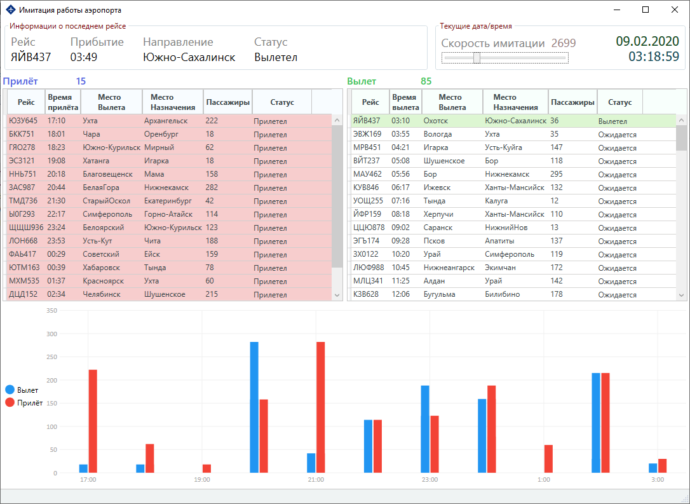

## Тестовое задание 

Простая программа для имитации табло аэропорта, с вылетом и прилетом рейсов.

При запуске программы генерируется XML файл со случайными рейсами и загружется. После чего начинается имитации работы табло аэропорта. Скорость имитации можно менять ползунком (Slider) на главном окне программы.

В левой таблице отображаются прилетевшие рейсы, в правой таблице вылетающие. На графике отображается трафик пассажиров.

